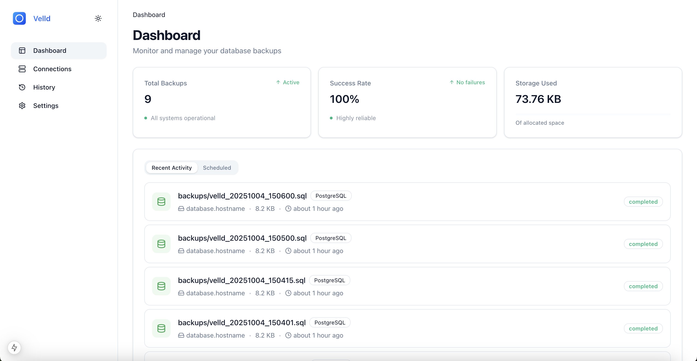

# Velld

A database backup management and automation tool. Velld provides a user-friendly interface for scheduling, managing, and monitoring database backups, ensuring data security and easy recovery.

## Table of Contents

- [Velld](#velld)
  - [Table of Contents](#table-of-contents)
  - [Features](#features)
  - [Screenshots](#screenshots)
    - [Dashboard Overview](#dashboard-overview)
    - [Connection Management](#connection-management)
    - [History](#history)
  - [Supported Databases](#supported-databases)
  - [Installation](#installation)
    - [Using Docker](#using-docker)
  - [Configuration](#configuration)
    - [Environment Variables](#environment-variables)
      - [**Environment Variable Details:**](#environment-variable-details)
    - [Binary Path Detection](#binary-path-detection)
  - [To-Do List](#to-do-list)
  - [Development Setup](#development-setup)
    - [Prerequisites](#prerequisites)
    - [Running API Locally](#running-api-locally)
    - [Running Web UI Locally](#running-web-ui-locally)
  - [Contribution](#contribution)
    - [Guidelines](#guidelines)
  - [License](#license)

## Features

- 🗄️ **Support for multiple database types**
- ⏰ **Automated backup scheduling**
- 🔔 **Notifications system**

## Screenshots

### Dashboard Overview

Monitor backup statistics and recent activities.

### Connection Management

Easily manage multiple database connections.

### History

View detailed backup history and logs.

## Supported Databases

- **PostgreSQL**
- **MySQL**
- **MongoDB**
- **More database support coming soon!**

## Installation

### Using Docker

```sh
# Clone the repository
git clone https://github.com/dendianugerah/velld.git

# Navigate to the project directory
cd velld

# Start the application
docker compose up -d
```

Once started, the application will be available at:
- **Web Interface**: [http://localhost:3000](http://localhost:3000)
- **API**: [http://localhost:8080](http://localhost:8080)

## Configuration

### Environment Variables

Create a `.env` file in the root directory or copy `.env.example`:

```sh
cp .env.example .env
```

Then, configure the following environment variables in `.env`:

```env
API_URL=http://localhost:8080
JWT_SECRET=your-jwt-secret
ENCRYPTION_KEY=your-encryption-key
```

#### **Environment Variable Details:**

| Variable          | Description                                                   | Required?     | Default Behavior                  |
|------------------|---------------------------------------------------------------|--------------|----------------------------------|
| `JWT_SECRET`     | Secret key for signing JWT tokens.                           | ❌ Optional  | Auto-generated if missing        |
| `ENCRYPTION_KEY` | Key for encrypting sensitive data (e.g., database credentials). | ❌ Optional  | Auto-generated if missing        |
| `NEXT_PUBLIC_API_URL`        | Base URL for the API used by the frontend.                   | ✅ Required  | None                             |

> **Note:** If `JWT_SECRET` or `ENCRYPTION_KEY` is missing from `.env`, Velld will automatically generate secure values and save them to the `.env` file.

### Binary Path Detection

By default, Velld will search for database dump binaries (`pg_dump`, `mysqldump`, `mongodump`, etc.) in common system paths:

- **Windows:** `C:\Program Files\<Database>\bin`
- **Linux:** `/usr/bin`, `/usr/local/bin`, `/opt/<Database>/bin`
- **MacOS:** `/opt/homebrew/bin`, `/usr/local/bin`

In a future update, users will be able to manually configure the binary path in the web application.

## To-Do List

- [ ] Allow users to define custom paths for database binaries from the web application
- [ ] Improve mobile view for better responsiveness
- [ ] Add support for more databases
- [ ] Implement additional storage options (AWS S3, Google Drive, etc.)
- [ ] Enhance notification system

## Development Setup

### Prerequisites

- **Go**
- **Node.js**

### Running API Locally

```sh
cd apps/api
go mod download
go run cmd/api-server/main.go
```

### Running Web UI Locally

```sh
cd apps/web
npm install
npm run dev
```

## Contribution

Contributions are welcome! If you find a bug or have a feature request, please open an issue or submit a pull request.

### Guidelines

1. Fork the repository and create a new branch.
2. Make your changes and ensure tests pass.
3. Submit a pull request with a clear description of the change.

## License

This project is licensed under the **MIT License**. See the [LICENSE](LICENSE) file for details.