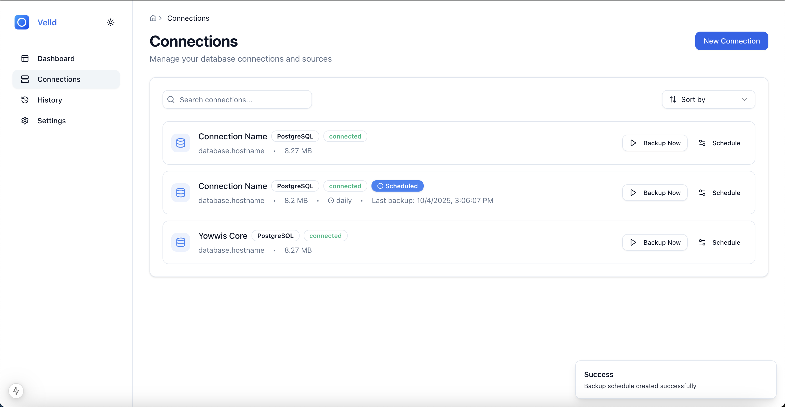

# Vell[](LICENSE)
[](https://www.docker.com/)
[](https://golang.org/)
[](https://nextjs.org/)

## Features

- **Self-Hosted** - Full control of your data and infrastructure
- **Simple Setup** - Get started in minutes with Docker
- **Smart Scheduling** - Flexible cron-based backup automation
- **Secure by Default** - Encrypted credentials and secure storage
- **Real-Time Monitoring** - Beautiful dashboard with stats and insights
- **Backup Comparison** - Compare any two backups to see what changed
- **Multi-Database** - PostgreSQL, MySQL, and MongoDB support
- **Lightweight** - Choose only the database clients you need

## Screenshots-hosted database backup automation**

Velld provides a beautiful web interface for scheduling, managing, and monitoring backups across multiple databases. Keep your data safe with automated backups, smart retention policies, and real-time monitoring.

[](LICENSE)
[](https://www.docker.com/)
[](https://golang.org/)
[](https://nextjs.org/)

## Features

- **Self-Hosted** - Full control of your data and infrastructure
- **Simple Setup** - Get started in minutes with Docker
- **Smart Scheduling** - Flexible cron-based backup automation
- **Secure by Default** - Encrypted credentials and secure storage
- **Real-Time Monitoring** - Beautiful dashboard with stats and insights
- **Backup Comparison** - Compare any two backups to see what changed
- � **Multi-Database** - PostgreSQL, MySQL, and MongoDB support
- **Lightweight** - Choose only the database clients you need

## Screenshots

### Dashboard Overview

*Monitor backup statistics, success rates, and recent activities*

### Connection Management

*Easily manage multiple database connections with scheduled backups*

### Backup History & Comparison

*View detailed backup history and compare any two backups*

## Supported Databases

- **PostgreSQL** 9.6+ (including TimescaleDB, PostGIS)
- **MySQL** 5.7+ / MariaDB 10.2+
- **MongoDB** 4.0+
- *More coming soon*

## Quick Start

Get Velld running in under 5 minutes:

```bash
# Clone the repository
git clone https://github.com/dendianugerah/velld.git
cd velld

# Start all services
docker compose up -d

# Access the web interface
open http://localhost:3000
```

**That's it!** Create your account and start backing up your databases.

### Database-Specific Installation

Want a lighter installation? Use only the database clients you need:

**PostgreSQL only:**
```yaml
# In docker-compose.yml, change:
dockerfile: Dockerfile.postgres  # ~50MB lighter!
```

**MySQL only:**
```yaml
dockerfile: Dockerfile.mysql  # ~55MB lighter!
```

**MongoDB only:**
```yaml
dockerfile: Dockerfile.mongo  # ~40MB lighter!
```

See the [Installation Guide](https://velld.dev/docs/installation) for detailed instructions.

## Documentation

Comprehensive documentation is available at **[velld.dev/docs](https://velld.dev/docs)**

- [Installation Guide](https://velld.dev/docs/installation) - Database-specific Docker configurations
- [Quick Start](https://velld.dev/docs/quick-start) - Create your first backup in 5 minutes
- [Database Setup](https://velld.dev/docs/databases) - Connect PostgreSQL, MySQL, or MongoDB
- [Scheduling Guide](https://velld.dev/docs/scheduling) - Master cron expressions and retention policies
- [Security Best Practices](https://velld.dev/docs/security) - Keep your backups secure

## Configuration

### Environment Variables

Create a `.env` file in the root directory:

```bash
# Copy the example file
cp .env.example .env
```

**Required variables:**

| Variable | Description | Example |
|----------|-------------|---------|
| `NEXT_PUBLIC_API_URL` | API endpoint URL | `http://localhost:8080` |
| `JWT_SECRET` | Secret key for JWT tokens | `your-super-secret-key` |
| `ENCRYPTION_KEY` | Key for encrypting credentials | `32-character-encryption-key` |

**Optional variables:**

| Variable | Description | Default |
|----------|-------------|---------|
| `ALLOW_REGISTER` | Allow new user registration | `true` |
| `ADMIN_USER_CREDENTIAL` | Admin username (if registration disabled) | - |
| `ADMIN_PASSWORD_CREDENTIAL` | Admin password (if registration disabled) | - |

**Email notifications (optional):**

```env
SMTP_HOST=smtp.gmail.com
SMTP_PORT=587
SMTP_USER=your-email@gmail.com
SMTP_PASSWORD=your-app-password
SMTP_FROM=noreply@yourdomain.com
```

> **Security Note:** In production, always use strong, random values for `JWT_SECRET` and `ENCRYPTION_KEY`.

## Development

### Prerequisites

- **Go** 1.20+
- **Node.js** 18+
- **Docker** (optional, for testing)

### Running Locally

**Backend (API):**
```bash
cd apps/api
go mod download
go run cmd/api-server/main.go
```

**Frontend (Web):**
```bash
cd apps/web
npm install
npm run dev
```

The web interface will be available at [http://localhost:3000](http://localhost:3000).

### Building for Production

```bash
# Build both services
docker compose build

# Or build individually
docker build -t velld-api ./apps/api
docker build -t velld-web ./apps/web
```

## Testing Your Setup

1. **Start Velld:**
   ```bash
   docker compose up -d
   ```

2. **Create your account** at [http://localhost:3000](http://localhost:3000)

3. **Add a test database connection:**
   - Use `host.docker.internal` for databases on your host
   - Click "Test Connection" to verify

4. **Run a manual backup:**
   - Click "Backup Now" on your connection
   - Watch it appear in the History page

5. **Schedule automatic backups:**
   - Click the schedule icon
   - Set a cron schedule (e.g., `0 2 * * *` for daily at 2 AM)

## Key Features Explained

### Backup Comparison
Compare any two backups to see exactly what changed:
- Line-by-line diff view
- Color-coded additions/deletions
- Split or unified view
- Perfect for tracking schema changes

### Smart Retention
Automatically delete old backups:
- Keep last 7, 14, 30, or 90 days
- Custom retention policies
- Free up storage automatically

### Real-Time Notifications
Stay informed about your backups:
- Email notifications
- In-app notification center
- Success/failure alerts
- Customizable preferences

## Contributing

We welcome contributions! Here's how you can help:

1. **Fork the repository**
2. **Create a feature branch** (`git checkout -b feature/amazing-feature`)
3. **Commit your changes** (`git commit -m 'Add amazing feature'`)
4. **Push to the branch** (`git push origin feature/amazing-feature`)
5. **Open a Pull Request**

### Development Guidelines

- Follow existing code style
- Add tests for new features
- Update documentation as needed
- Keep commits atomic and well-described

## License

This project is licensed under the MIT License - see the [LICENSE](LICENSE) file for details.

---

## Support & Community

- **⭐ Star this repo** if you find it helpful!
- **🐛 Report bugs** via [GitHub Issues](https://github.com/dendianugerah/velld/issues)
- **💡 Request features** via [GitHub Discussions](https://github.com/dendianugerah/velld/discussions)
- **📖 Read the docs** at [velld.dev/docs](https://velld.dev/docs)

---

<div align="center">
  <p>Built with ❤️ by <a href="https://github.com/dendianugerah">dendianugerah</a></p>
  <p>
    <a href="https://github.com/dendianugerah/velld">GitHub</a> •
    <a href="https://velld.dev">Website</a> •
    <a href="https://velld.dev/docs">Documentation</a>
  </p>
</div>

## Contribution

Contributions are welcome! If you find a bug or have a feature request, please open an issue or submit a pull request.

### Guidelines

1. Fork the repository and create a new branch.
2. Make your changes and ensure tests pass.
3. Submit a pull request with a clear description of the change.

## License

This project is licensed under the **MIT License**. See the [LICENSE](LICENSE) file for details.
